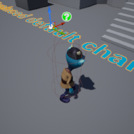

# Project Name Character01

## Descripton

A github repository for the in class demonstration Dec 2 showing one method of replacing the default character in a defult/template based game. 

## Usage
Clone, or download the zip, to a local directory. Open in Unreal Engine 4.26 or newer

